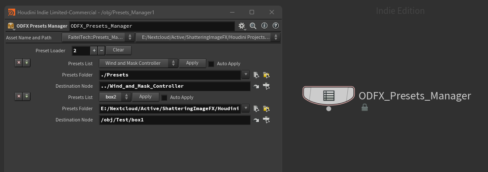

# ODFX Presets Manager for Houdini Indie
Extension node for OD Tools in Houdini for applying parameter values from JSON files
### Disclaimer: This repository is a user initiative and is not directly related to the [OD Tools](https://origamidigital.com/cart/) or its author.

This node is an extension for the paid third-party plugin for Houdini called OD Tools and requires its Python modules to work:
You can check the tools at the https://origamidigital.com/cart/:

OD Tools has a feature that allows saving all parameters of the specified nodes:

    1. Right Click on any node to call Context Menu
    2. Go to ODTools Parameters -> Save All Parms to Json
    3. Specify a name and a folder on disk to save json file (use absolute folder path to avoid saving errors)
    4. Press Accept

After that, you can restore parameters from the json file:

    1. Right Click on any node to call Context Menu
    2. Go to ODTools Parameters -> Import Parms from Json
    3. Specify a json file on disk
    4. Press Accept
    
One helpful feature of this tool is its ability to load parameters matched by name, even if the destination and source nodes are different; that means you can easily apply parameter values from one node to another, simplifying your workflow and saving time.

The node streamlines the process of importing parameters from the json file. So, you only need to set the path in the "Preset Folder" parameter, and the "Preset List" will be auto-populated by json files located in the folder.

The preset name will be converted from the file name by the following pattern:

    1. Replacing all underscore with space.
    2. Remove the ".json" extension.

Specify the "Destination node" into which the node will try to import parameters from the JSON file.

Select a preset in the "Presets List" and press "Apply" to import parameters.

Toggle "Auto Apply" to force the preset to be loaded when selecting the "Presets List" item. That may help you quickly iterate over presets, but don't forget to press "Apply" to toggle off the "Auto Apply" parameter to avoid unexpected rewriting of parameters on the destination node. 

The "destination node" can be a node of any context.

The node based on the OD Tools Python code shared in discord by [Olive Hotz](https://discord.com/channels/279443049069674496/625410894200832061/1244293453026693120):

```Python
from OD import shelftools
shelftools.nodeParmsFromJson([node], path_to_json_file)
```

## Parameters description:

Auto Apply:

    Automatically apply the preset when changed. If disabled, you need to manually apply the preset by pressing the apply button.

Presets:

    Select the preset file to load. This dropdown is populated based on the JSON files found in the specified presets folder.

Destination Node:

    Specify the destination node where the preset parameters will be applied. Enter the path to the node.

Presets Folder:

    Specify the folder containing the preset JSON files. This folder will be scanned to populate the presets dropdown menu.

Open Folder:

    Open the specified presets folder in the system file manager.

